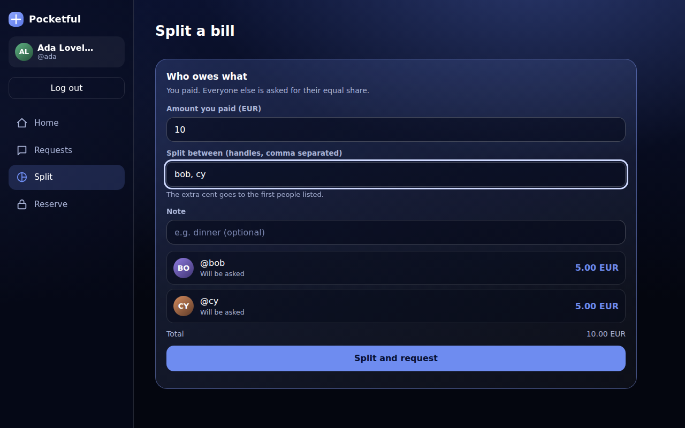

# Moneta

**A four-seat dark factory in Band Desktop, and the payments app it built from one human message.**

WeAreDevelopers x BAND "Dark Factory" hackathon · **Track: pocketful** · **Stages: 1 and 2**

---

## The problem

Coding agents can now write a whole service, but nobody can trust code that no person
has read. A single agent marks its own homework: it writes the code, writes the tests,
and reports green. Sample tests pass while the requirements nobody tested stay broken,
and in a payments app a quiet bug means money created, lost or moved twice.

To let agents build software unattended, the checking has to be as independent as the
building, and the evidence has to be something a person can audit afterwards.

## The solution

Moneta splits the work across four seats in one Band room, so that no seat ever checks its
own work and every stage is accepted only on independent evidence:

| Seat | Job | Hard limit |
|---|---|---|
| `lead` | Turns every sentence of the spec into a numbered **ledger**, hands out small work items, writes the stage report | never writes product code |
| `builder` | Writes all product code, `Dockerfile` and `RUN.md` | the only seat that writes code; never accepts its own work |
| `examiner` | Writes a black-box **exam from the spec alone, before seeing any code**, then runs every revision itself with no network | never edits product code |
| `guest` | Uses every screen in real Chrome at 375 px and 1280 px, forcing slow, lost, refused and stale moments | never reads source to excuse a screen |

- **The ledger marks what the sample tests never check.** Those lines are where hidden
  tests live, so they are named before any code is written.
- **A stage is accepted only when the examiner (and the guest, for screens) pass the same
  commit.** Rejections go back to the builder unchanged, quoting the ledger line.
- **Everything is on the record:** each seat commits under its own name, and the whole
  conversation is in `room.json`.

## What the app does

The factory built a calm, dark consumer money app, on phone and desktop:

- **Split a bill with friends.** Enter what you paid and your friends' handles; every
  friend's share appears live, with their initials, before anything is sent. Each friend
  then gets a request for exactly their share, down to the last cent, and the extra cent
  goes to the first people listed.
- **Send money by handle**, public or private, and see it in an activity feed.
- **Request money**, and pay, decline or cancel requests.
- **Hold and capture:** reserve funds, then capture part or all of them, or release them.
  Available funds are always the biggest number on screen.
- **Never pay twice.** If the connection drops after you press send, the app says it cannot
  be sure the payment went through and lets you retry safely; the retry can only move the
  money once.



## What it caught

In stage 2 the examiner found a real money bug: after a refused capture of a hold, a
delayed refresh overwrote the amount the user had typed, so the next capture could move the
wrong amount (2 runs out of 6). It rejected revision `539880c`; the builder fixed it in
`f87c6d5`; the fix passed 15 runs out of 15. The guest separately sent back two usability problems
(a header cut off at phone width, and an expiry shown only as a raw timestamp), both fixed
before acceptance.

## Results

| Stage | What it is | Accepted revision | Ledger | Time |
|---|---|---|---|---|
| 1 | JSON API: payments, requests, splits, settlements, idempotent writes, export/import | `65f67c1` | 75 lines (28 unchecked by samples) | about 19 min |
| 2 | Stage 1 plus the browser app: balance and pay, activity, requests, splits with live shares, holds and captures, recovery from lost and stale responses | `f87c6d5` | 60 lines plus stage-1 regression | about 59 min |

- On a fresh clone, BAND's harness in isolated mode reports `stage-1/` claiming stage 1 and
  `stage-2/` claiming stage 2.
- Model usage for the whole run: about **$12** of Claude Sonnet at list prices, on a Pro plan.
- One human message started the run; nothing else was sent.
- The run stopped at the start of stage 3 when the Claude Pro session limit was reached.
  We left it as it was rather than nudge it. [`FACTORY.md`](FACTORY.md) explains what
  happened and what we would change.

## Run a stage

Each stage folder is a complete service. From inside it:

```sh
docker build -t moneta-stage2 . && docker run --rm -p 8080:8080 -e PORT=8080 moneta-stage2
```

Then open http://localhost:8080 (stage 2) or `curl localhost:8080/health`.

## How to read this repository

| Path | What it is |
|---|---|
| [`FACTORY.md`](FACTORY.md) | The factory in full: design choices, what it caught, cost and time, what stopped it, how to stand it up |
| [`mandates/`](mandates/) | One generic mandate per seat, each naming its harness and model |
| `room.json` | The full Band room the factory worked in, downloaded unchanged |
| [`dispatch/`](dispatch/) | The task file the one human message pointed to, unchanged |
| [`verification/`](verification/) | BAND's harness reports from an isolated run on a fresh clone |
| [`evidence/guest-stage-2/`](evidence/guest-stage-2/) | The guest's screenshots from its phone and desktop review of stage 2 |
| [`stage-1/`](stage-1/), [`stage-2/`](stage-2/) | The services the factory built, one complete folder per stage |
| [`ledger/`](ledger/) | The lead's requirement ledger per stage, written before any code |
| [`exam/`](exam/) | The examiner's black-box exams, committed after each stage was accepted |
| [`reports/`](reports/) | The lead's report for each accepted stage |

## Team

IMPRINT (solo), [@imprint-hash](https://github.com/imprint-hash)
